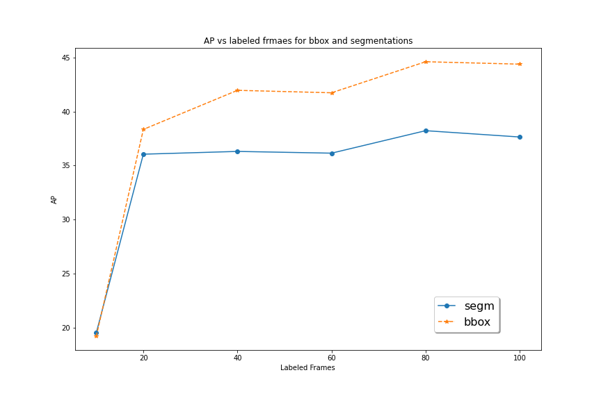
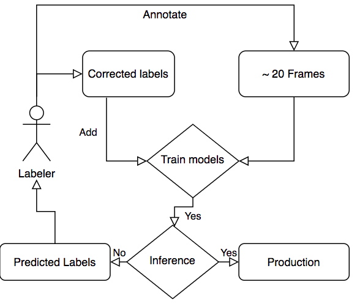

# annolid

[](https://github.com/healthonrails/annolid/actions)
[](https://github.com/healthonrails/annolid/actions)
[](https://zenodo.org/badge/latestdoi/290017987)
[](https://pepy.tech/project/annolid)
[](https://arxiv.org/abs/2403.18690) 


## An annotation and instance segmentation-based multiple animal tracking and behavior analysis package.

## Annolid: Annotate, Segment, and Track Anything You Need
Annolid is a deep learning-based software package designed for the segmentation, labeling, and tracking of research targets within video files, focusing primarily on animal behavior analysis. Based on state-of-the-art instance segmentation methods, Annolid now harnesses the Cutie video object segmentation model to achieve resilient, markerless tracking of multiple animals from single annotated frames, even in environments in which they may be partially or entirely concealed by environmental features or by one another. Our integration of Segment Anything and Grounding-DINO strategies additionally enables the automatic masking and segmentation of recognizable animals and objects by text command, removing the need for manual annotation. Annolid's comprehensive approach to object segmentation flexibly accommodates a broad spectrum of behavior analysis applications, enabling the classification of diverse behavioral states such as freezing, digging, pup huddling, and social interactions in addition to the tracking of animals and their body parts.

## Effortless Multiple Instance Tracking using Annolid: Beginner's Tutorial

[](https://www.youtube.com/embed/ry9bnaajKCs?si=o_rdLobKeKb4-LWX)


## Effortless Object Labeling with Minimal Points: Automated Polygon Generation using Segment Anything Models


## Overview of Annolid workflow


* Labeling of frames (annotation)
* COCO formatting
* Training and inference (local or Colab)
* Post-processing and analysis

## Annolid video tutorials

[](https://www.youtube.com/embed/videoseries?list=PLYp4D9Y-8_dRXPOtfGu48W5ENtfKn-Owc "Annolid Youtube playlist")
|   YouTube Channel | Annolid documentations|
| :-------------------------------------: | :----------------------------: |
|  |  |

## User Guide

A basic user guide with installation instructions and recent documentation can be found at [https://cplab.science/annolid or https://annolid.com](https://annolid.com).

## Examples
[](https://youtu.be/lTlycRAzAnI)

|         Instance segmentations          |      Behavior prediction       |
| :-------------------------------------: | :----------------------------: |
|  |  |

[](http://www.youtube.com/watch?v=op3A4_LuVj8)

Mouse behavior analysis with instance segmentation based deep learning networks

## Local Installation
### First you need to install [anaconda](https://docs.anaconda.com/anaconda/install/index.html).
create a conda env
```
conda create -n annolid-env python=3.11
conda activate annolid-env
conda install git
conda install ffmpeg 
```
* Clone the code repo and change into the directory
```bash
git clone --recurse-submodules https://github.com/healthonrails/annolid.git
cd annolid
```

The pip install command will attempt to determine your computer's resources (like a GPU) automatically.  To control this directly, you alternatively can use the conda env command and the appropriate environment file (.yml).
For alternative installation methods, see the Annolid documentation ([https://cplab.science/annolid or https://annolid.com](https://cplab.science/annolid)).

### Recommended steps for Ubuntu 20.04 machine with GPUs
* Open a terminal window and navigate to the directory where the Annolid source code was downloaded.

* Create a Conda environment based on the specifications in the environment.yml file located in the Annolid source code directory using the following command:

```bash
conda env create -f environment.yml
```
This command will create a new Conda environment with the required packages and dependencies needed to run Annolid on an Ubuntu 20.04 machine with GPUs.

* Activate the new Conda environment using the following command:
```bash
conda activate annolid-env 
```

* Verify that the installation was successful by running the annolid
```bash
annolid
```
Note: For error NVIDIA GeForce RTX 3090 with CUDA capability sm_86 is not compatible with the current PyTorch installation,
please try the following command.
```
 conda install pytorch==2.2.0 torchvision==0.17.0 torchaudio==2.2.0 cudatoolkit=12.1 -c pytorch -c nvidia

```

That's it! You should now have Annolid installed on your Ubuntu 20.04 machine with GPUs and be able to use it for video analysis and annotation tasks.
### Note for Mac M1/M2 Chip users
If you encounter the folloing errors,
```
Intel MKL FATAL ERROR: This system does not meet the minimum requirements for use of the Intel(R) Math Kernel Library.
The processor must support the Intel(R) Supplemental Streaming SIMD Extensions 3 (Intel(R) SSSE3) instructions.
The processor must support the Intel(R) Streaming SIMD Extensions 4.2 (Intel(R) SSE4.2) instructions.
The processor must support the Intel(R) Advanced Vector Extensions (Intel(R) AVX) instructions.
[end of output]
```
Please try the following commands.
```
conda create -n annolid-env python=3.11
conda activate annolid-env 
# Please skip this git clone step, if you have already done it in the previous step
git clone --recurse-submodules https://github.com/healthonrails/annolid.git
cd annolid
pip install -e .
annolid
```

Note: To train instance segmentation models, please install Detectron2 in your Annolid environment by following these steps:

Activate your Annolid environment (if not already activated):

```sh
conda activate annolid-env

```
Install Detectron2:
```sh
python -m pip install --user 'git+https://github.com/facebookresearch/detectron2.git'
```
Note: if you got this error:
`ERROR: Could not find a version that satisfies the requirement decord>=0.4.0`
try to install [ffmpeg](https://ffmpeg.org/) or you can install it in conda with `conda install -c conda-forge ffmpeg`.

FYI: it is helpful to compress videos to reduce diskspace using ffmpeg using `ffmpeg -i my_video.mp4 -vcodec libx264 my_video_compressed.mp4`

Tip: to fix the error like `objc[13977]: Class QCocoaPageLayoutDelegate is implemented in both /Users/xxx/anaconda3/envs/annolid-env/lib/python3.7/site-packages/cv2/.dylibs/QtGui (0x10ebd85c0) and /Users/xxx/anaconda3/envs/annolid-env/lib/python3.7/site-packages/PyQt5/Qt/lib/QtPrintSupport.framework/Versions/5/QtPrintSupport (0x10fc9d540`, please try the command `conda install qtpy`. 
## Launch annolid user interface based on labelme
```bash
source activate annolid-env
annolid
#or you can provide a label.txt file as follows.
annolid --labels=/path/to/labels_custom.txt

```

### Optional: Using SAM2 for Object Tracking

If you want to use SAM2 for tracking objects, follow these steps:

1. Navigate to the `segment-anything-2` directory:
    ```bash
    cd segmentation/SAM/segment-anything-2
    ```

2. Install the package in editable mode:
    ```bash
    pip install -e .
    ```
### Additional Dependencies

If you are installing Annolid using `pip install annolid`, you will also need to install the `segment-anything` package from the GitHub repository. Follow these steps:

1. Install the `segment-anything` package:
    ```bash
    pip install "segment-anything @ git+https://github.com/SysCV/sam-hq.git"
    ```

This will install the `segment-anything` package from the specified GitHub repository.


If you want to learn more about labelme, please check the following link.

[Read more about annotations](annolid/annotation/labelme.md)


## How to label animals and behaviors?
### Polygons & keypoints(e.g. Vole_1, nose, tail_base, rearing…...)

* To train models for tracking animals and assigning IDs, please
label each instance with a unique name or ID (e.g. vole_1, mouse_2, or frog_femal_01).

* For instances without needing to assign IDs across different frames or videos, please label instances with a generic name or ID (e.g vole, mouse, or frog).

* For encoding behaviors, please name the ploygon with the behavior name (e.g. rearing, object_investigation, or grooming)

* For body parts, please use keypoint with names like nose, tail_base, or left_ear.

## annolid config file
The first time you run annolid, it will create a config file in the user's home directory ~/.labelmerc
 (C:\Users\<username>\.labelmerc on Windows). 
 You can edit this file, and the changes will take effect the next time you launch annolid. 
 To set the auto_save option to true, open the labelmerc file in a text editor and add the line auto_save: true. 
 Save the changes, and labelme will automatically save your annotations when you make them.
If you prefer to use a config file from a different location, 
  you can specify the file path by using the --config flag followed by the path to your desired config file.

## Instructions for labeling behaviors with timestamps using keys:

### To label behaviors, use the following key shortcuts:
* Press 's' to indicate the start of an event.
* Press 'e' to mark the end of an event.
* If you click play on the seek bar, it will play with a specific interval.
* Use 'f' to add 10 frames and 'b' to subtract 10 frames at a time.
### To edit the predicted timestamps provided by Annolid:
* Click the tick mark on the video slider bar.
* Press 'r' to remove the event.
### Once you have finished labeling the behaviors, follow these steps:
* Click the "Save Timestamps" button to save the scored behaviors.

## To enable frame-level labels in Annolid using a multi-select component:

* Launch Annolid with the "--flags" option. For example: annolid --flags "digging,rearing,grooming".
* This will display a flags list with a multi-select component.
* In the multi-select component, you can see a list of available labels.
* If you choose an event or behavior item from the flags list and then press 's,' it will encode that behavior or event. Pressing the 'e' key will encode the end of the behavior.
* To eliminate the added event from the seekbar, simply press the 'R' key.
### To save the selected frame-level labels in Annolid, you can follow either of these methods:
* Press Ctrl+S: 
    Use the keyboard shortcut Ctrl+S to save the selected frame-level labels.
* Click the "Save" button: 
    Alternatively, you can click the "Save" button in the user interface to save the selected frame-level labels.

## How many frames do you need to label?

* 20 to 100 frames per video


* For autolabeling, you can label 20 frames and train a model. Then you can use the trained model to predict on the video and add the corrected predictions to the training set to train a better model. Repeat the process until the model is matching human performance.
  

* Write labeling guidelines by starting with this [template](https://docs.google.com/document/d/1fjgRSni7PNzMCSKw7NqVfGAp29phcf3NzrAojUhpVUY/edit#).
## Tracking and re-identification

* To link instances across frames, we treat each instance as its own class across frames.
* To track multiple animals, label each animal as a separate instance.
* To generalize across animals or videos, label multiple animals as examples of the same instance.  

# Docker

Please make sure that [Docker](https://www.docker.com/) is installed on your system.
```
# on Linux
cd annolid/docker
docker build .
xhost +local:docker
docker run -it -v /tmp/.X11-unix:/tmp/.X11-unix/ -e DISPLAY=$DISPLAY  <Image ID>

```

# Citing Annolid
If you use Annolid in your research, please use the following BibTeX entry.
```
@misc{yang2024annolid,
      title={Annolid: Annotate, Segment, and Track Anything You Need}, 
      author={Chen Yang and Thomas A. Cleland},
      year={2024},
      eprint={2403.18690},
      archivePrefix={arXiv},
      primaryClass={cs.CV}
}

@article{yang2023automated,
  title={Automated Behavioral Analysis Using Instance Segmentation},
  author={Yang, Chen and Forest, Jeremy and Einhorn, Matthew and Cleland, Thomas A},
  journal={arXiv preprint arXiv:2312.07723},
  year={2023}
}

@misc{yang2020Annolid,
  author =       {Chen Yang, Jeremy Forest, Matthew Einhorn, Thomas Cleland},
  title =        {Annolid:  an instance segmentation-based multiple animal tracking and behavior analysis package},
  howpublished = {\url{https://github.com/healthonrails/annolid}},
  year =         {2020}
}
```

# Other research papers or open-access preprints utilizing Annolid.

```
@article{pranic2022rates,
  title={Rates but not acoustic features of ultrasonic vocalizations are related to non-vocal behaviors in mouse pups},
  author={Pranic, Nicole M and Kornbrek, Caroline and Yang, Chen and Cleland, Thomas A and Tschida, Katherine A},
  journal={bioRxiv},
  year={2022},
  publisher={Cold Spring Harbor Laboratory}
}

@article{pattison2022digging,
  title={Digging deeper into pain: an ethological behavior assay correlating well-being in mice with human pain experience},
  author={Pattison, Luke A and Cloake, Alexander and Chakrabarti, Sampurna and Hilton, Helen and Rickman, Rebecca H and Higham, James P and Meng, Michelle Y and Paine, Luke W and Dannawi, Maya and Qiu, Lanhui and others},
  journal={Pain},
  pages={10--1097},
  year={2022},
  publisher={LWW}
}

```

[For more information:](https://cplab.science/annolid) https://cplab.science/annolid
.

# SfN 2021 poster
[Annolid: an instance segmentation-based multiple-animal tracking
and behavior analysis package
](https://youtu.be/tVIE6vG9Gao)

# SfN 2023 posters
* PSTR512.02 - Annolid: Annotate, Segment, and Track Anything You Need
* PSTR512.01 - Scoring rodent digging behavior with Annolid

# Datasets
**New** An example dataset annotated by Annolid and converted to COCO format dataset is now available from
this Google Drive link https://drive.google.com/file/d/1fUXCLnoJ5SwXg54mj0NBKGzidsV8ALVR/view?usp=sharing.

# Pretrained models
The pretrained models will be shared to the [Google Drive folder](https://drive.google.com/drive/folders/1t1eXxoSN2irKRBJ8I7i3LHkjdGev7whF?usp=sharing).

# Feature requests and bug reports

To request a new feature or report bugs, please use the link https://github.com/healthonrails/annolid/issues here.

# Annolid Google groups
[annolid@googlegroups.com](https://groups.google.com/g/annolid)

### Videos

* [YouTube Channel](https://www.youtube.com/@annolid)

### Acknowledgement

(Annolid's tracking module integrates **Cutie** for enhanced video object segmentation. If you find this feature useful, please cite the original Cutie paper and repository:

#### Paper:

Ho Kei Cheng, Seoung Wug Oh, Brian Price, Joon-Young Lee, and Alexander Schwing. *Putting the Object Back into Video Object Segmentation*, arXiv, 2023.

#### Code:
*[Code for Cutie available here](https://github.com/hkchengrex/Cutie)*

We appreciate the Cutie team's valuable contributions and continued support.)

Annolid's counting tool integrates CountGD. If you find this feature useful, please cite the original CountGD paper and repository:

#### Paper:

Niki Amini-Naieni, Tengda Han, and Andrew Zisserman. CountGD: Multi-Modal Open-World Counting In Advances in Neural Information Processing Systems, 2024.

#### Code:
*[Code for CountGD available here](https://github.com/niki-amini-naieni/CountGD/tree/main)

We are grateful for the CountGD team's contribution and support.