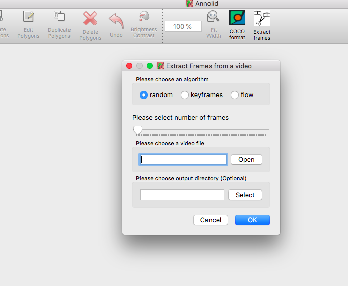
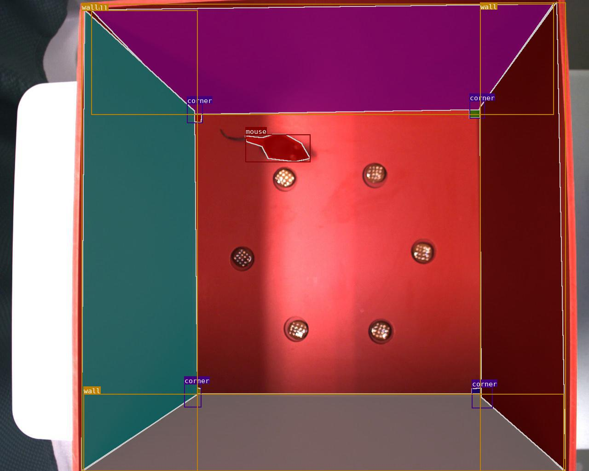

# annolid

[](https://github.com/healthonrails/annolid/actions)
[](https://github.com/healthonrails/annolid/releases/latest)
[](https://zenodo.org/badge/latestdoi/290017987)
[](https://pepy.tech/project/annolid)
[](https://arxiv.org/abs/2403.18690)

> Annotate, segment, and track multiple animals (or any research target) in video with a single toolchain.

## Table of Contents
- [Overview](#overview)
- [Key Features](#key-features)
- [Documentation & Support](#documentation--support)
- [Quick Start](#quick-start)
- [Installation Options](#installation-options)
- [Using Annolid](#using-annolid)
- [Annotation Guide](#annotation-guide)
- [Labeling Best Practices](#labeling-best-practices)
- [Tutorials & Examples](#tutorials--examples)
- [Troubleshooting](#troubleshooting)
- [Docker](#docker)
- [Citing Annolid](#citing-annolid)
- [Publications](#publications)
- [Additional Resources](#additional-resources)
- [Acknowledgements](#acknowledgements)
- [Contributing](#contributing)
- [License](#license)

## Overview
Annolid is a deep learning toolkit for animal behavior analysis that brings annotation, instance segmentation, tracking, and behavior classification into a single workflow. It combines state-of-the-art models—including Cutie for video object segmentation, Segment Anything, and Grounding DINO—to deliver resilient, markerless tracking even when animals overlap, occlude each other, or are partially hidden by the environment.

Use Annolid to classify behavioral states such as freezing, digging, pup huddling, or social interaction while maintaining fine-grained tracking of individuals and body parts across long video sessions.

> **Python support:** Annolid runs on Python 3.10–3.13. The toolkit is not yet validated on Python 3.14, where several binary wheels (PyQt, Pillow) are still pending upstream releases.

## Key Features
- Markerless multiple-animal tracking from a single annotated frame.
- Instance segmentation powered by modern foundation models and transfer learning.
- Interactive GUI for rapid annotation (LabelMe-based) plus automation with text prompts.
- Behavioral state classification, keypoint tracking, and downstream analytics.
- Works with pre-recorded video or real-time streams; supports GPU acceleration.
- Optional EfficientTAM video tracking backend, fully integrated and auto-downloaded (no separate installation needed).

## Documentation & Support
- Latest documentation and user guide: [https://annolid.com](https://annolid.com) (mirror: [https://cplab.science/annolid](https://cplab.science/annolid))
- Community updates and tutorials are shared on the [Annolid YouTube channel](https://www.youtube.com/@annolid).
- Sample datasets, posters, and publications are available in the `docs/` folder of this repository.
- Join the discussion on the [Annolid Google Group](https://groups.google.com/g/annolid).

## Featured Use Case
- **Tracking Four Interacting Mice with One Labeled Frame | 10-Minute Experiment**
  See how Annolid bootstraps multi-animal tracking from a single labeled frame in a fast end-to-end workflow:
  [https://youtu.be/PNbPA649r78](https://youtu.be/PNbPA649r78)
- For more practical examples and walkthroughs, visit the [Annolid YouTube channel](https://www.youtube.com/@annolid).

## Quick Start (Anaconda)

If you prefer using [Anaconda](https://docs.anaconda.com/anaconda/install/index.html) to manage environments:

```bash
conda create -n annolid-env python=3.11
conda activate annolid-env
conda install git ffmpeg
git clone --recurse-submodules https://github.com/healthonrails/annolid.git
cd annolid
pip install -e .
annolid  # launches the GUI
```

## Installation

### 🚀 One-Line Installation (Recommended)

Get Annolid running in minutes with our automated script. It handles downloading, environment setup, and dependency installation (including `uv` acceleration if available).

**macOS / Linux:**
```bash
curl -sSL https://raw.githubusercontent.com/healthonrails/annolid/main/install.sh | bash
```

**Windows (PowerShell):**
```powershell
irm https://raw.githubusercontent.com/healthonrails/annolid/main/install.ps1 | iex
```

The script will:
- Clone the repository.
- Detect your OS and Hardware (Intel/Apple Silicon).
- Create an isolated virtual environment.
- Prompt for optional features (SAM3, Text-to-Speech, etc.).
- Offer to launch Annolid immediately.

For a full breakdown of one-line installer choices (GPU vs CPU, interactive vs non-interactive, custom paths, Conda, and extras), see:
- [One-Line Installer Choices (Detailed Guide)](docs/one_line_install_choices.md)

### Other Installation Methods

For advanced users, Docker, Conda, or manual Pip installation, please see the [Detailed Installation Guide](docs/installation.md).

## Using Annolid
- Launch the GUI:
  ```bash
  conda activate annolid-env
  annolid
  ```
- Provide custom labels:
  ```bash
  annolid --labels=/path/to/labels_custom.txt
  ```
- Pick between Ollama, OpenAI GPT, or Google Gemini for caption chat features by opening the caption panel and clicking `Configure…` next to the model selector. API keys are stored in `~/.annolid/llm_settings.json`.
- Open **AI & Models → Annolid Bot…** to launch a dedicated right-side WhatsApp-style multimodal chat dock (streaming chat, local `openai/whisper-tiny` speech-to-text for Talk/Record, voice talk/read controls, and one-click canvas/window sharing).
- In Annolid Bot, enable `Allow web` to let Annolid Bot use `web_search`/`web_fetch` tools for web browsing in that chat turn (requires `BRAVE_API_KEY` for search).
- Summarise annotated behavior events into a time-budget report (GUI: *File → Behavior Time Budget*; CLI example with 60 s bins and a project schema):
  ```bash
  python -m annolid.behavior.time_budget exported_events.csv \
      --schema project.annolid.json \
      --bin-size 60 \
      -o time_budget.csv
  ```
- Compress videos when storage is limited:
  ```bash
  ffmpeg -i input.mp4 -vcodec libx264 output_compressed.mp4
  ```

## Video Depth Anything

- Run depth estimation on the currently loaded video via **View → Video Depth Anything…**. Use **View → Depth Settings…** to pick the encoder, resolution, FPS downsampling, and which outputs to save.
- Pretrained weights belong under `annolid/depth/checkpoints`. Download just what you need via the bundled Python helper (uses `huggingface-hub`, already listed in dependencies):
  ```bash
  cd annolid
  python -m annolid.depth.download_weights --model video_depth_anything_vitl
  ```
  Pass `--all` to fetch every checkpoint, or run `python -m annolid.depth.download_weights --list` for the full menu. Existing files are never re-downloaded.
- The GUI runner now auto-downloads whichever checkpoint you select in the dialog, so you only need to invoke the helper when you want to prefetch models ahead of time.
- Depth run now streams inference frame-by-frame, emits a single `depth.ndjson` record alongside the video (with per-frame base64 depth PNGs plus scale metadata) instead of writing separate JSON files per frame, and still shows a live blended overlay while processing. Enable `save_depth_video` or `save_depth_frames` only if you also need rendered outputs.
- Optional exports include `depth_frames/`, `<video_stem>_vis.mp4`, point cloud CSVs, `*.npz`, and `*_depths_exr/` (EXR requires `OpenEXR`/`Imath`).
- Full walkthrough: `docs/source/video_depth_anything.md`.

## CoWTracker Setup

If you want to run the CoWTracker backend, install Annolid with the CowTracker extra:

```bash
pip install "annolid[cowtracker]"
# or from source
pip install -e ".[cowtracker]"
```

If Annolid is already installed, add only the CowTracker dependency:

```bash
pip install "safetensors>=0.4.0"
```

Then select **CoWTracker** in the model dropdown. The model checkpoint is fetched
from Hugging Face on first use.

CowTracker uses a minimal vendored VGGT runtime subset under:

`annolid/tracker/cowtracker/cowtracker/thirdparty/vggt`

If that vendored subset is not present, CowTracker can also use an externally
installed `vggt` package. See `annolid/tracker/cowtracker/README.md` for the
required vendored file list and packaging notes.

## Annotation Guide


- **Label polygons and keypoints clearly.** Give each animal a unique instance name when tracking across frames (for example, `vole_1`, `mouse_2`). Use descriptive behavior names (`rearing`, `grooming`) for polygons dedicated to behavioral events, and name body-part keypoints (`nose`, `tail_base`) consistently.
- **Accelerate timestamp annotation.** While scoring behaviors, press `s` to mark the start, `e` to mark the end, `f`/`b` to step ±10 frames, and `r` to remove events directly from the video slider.
- **Enable frame-level flags.** Launch Annolid with `--flags "digging,rearing,grooming"` to open a multi-select list of behaviors. Save selections with `Ctrl+S` or the **Save** button; remove events by pressing `R`.
- **Customize configuration.** The first run creates `~/.labelmerc` (or `C:\Users\<username>\.labelmerc` on Windows). Edit this file to change defaults such as `auto_save: true`, or supply an alternative path via `annolid --config /path/to/file`.
- **Learn more.** Additional annotation tips live in `annolid/annotation/labelme.md`.

## Labeling Best Practices
- Label 20–100 frames per video to reach strong performance; the curve in `docs/imgs/AP_across_labeled_frames.png` shows how accuracy scales with annotation volume.
- Close the loop with human-in-the-loop training (see `docs/imgs/human_in_the_loop.png`): train on initial annotations, auto-label, correct, and retrain until predictions align with human expectations.
- Draft labeling guidelines up front—start with [this template](https://docs.google.com/document/d/1fjgRSni7PNzMCSKw7NqVfGAp29phcf3NzrAojUhpVUY/edit#) and adapt it to your species and behaviors.
- Treat each animal instance as its own class when you need cross-frame identity. Use generic class names only when identity consistency is unnecessary, or when you are aggregating across many individuals.
- To generalize to new animals or videos, include diverse examples of each behavior and adjust the training set iteratively.

## Tutorials & Examples
- Featured demo: [Tracking Four Interacting Mice with One Labeled Frame | 10-Minute Experiment](https://youtu.be/PNbPA649r78)
- DINOv3 Keypoint Tracking tutorial: book/tutorials/DINOv3_keypoint_tracking.md
[](https://www.youtube.com/embed/ry9bnaajKCs?si=o_rdLobKeKb4-LWX)


[](https://www.youtube.com/embed/videoseries?list=PLYp4D9Y-8_dRXPOtfGu48W5ENtfKn-Owc "Annolid Youtube playlist")
|   YouTube Channel | Annolid documentations|
| :-------------------------------------: | :----------------------------: |
|  |  |

[](https://youtu.be/lTlycRAzAnI)

| Instance segmentations | Behavior prediction |
| :--------------------: | :-----------------: |
|  |  |

[](http://www.youtube.com/watch?v=op3A4_LuVj8)

## Troubleshooting
- Video playback errors (`OpenCV: FFMPEG: tag ...` or missing codecs):
  Install FFmpeg via your package manager or `conda install -c conda-forge ffmpeg` to extend codec support.
- macOS Qt warning (`Class QCocoaPageLayoutDelegate is implemented in both ...`):
  `conda install qtpy` resolves the conflict between OpenCV and PyQt.
- If the GUI does not launch, confirm the correct environment is active and run `annolid --help` for CLI usage.
- For model training/inference from the terminal, use `annolid-run list-models`, `annolid-run train <model> --help-model`, and `annolid-run predict <model> --help-model`.
- YOLOE-26 prompting (text, visual, prompt-free) is available via `annolid-run predict yolo_labelme` and in the GUI video inference workflow (see `docs/source/yoloe_prompting.md`).
- For an interactive TensorBoard embedding projector view of DinoKPSEG DINOv3 patch features, run `annolid-run dino-kpseg-embeddings --data /path/to/data.yaml [--weights /path/to/best.pt]` and then `tensorboard --logdir <run_dir>/tensorboard` (some DINOv3 checkpoints require a Hugging Face token).

## Docker
Ensure [Docker](https://www.docker.com/) is installed, then run:
```bash
cd annolid/docker
docker build .
xhost +local:docker  # Linux only; allows GUI forwarding
docker run -it -v /tmp/.X11-unix:/tmp/.X11-unix/ -e DISPLAY=$DISPLAY <IMAGE_ID>
```
Replace `<IMAGE_ID>` with the identifier printed by `docker build`.

## Citing Annolid
If you use Annolid in your research, please cite:
- **Preprint:** [Annolid: Annotation, Instance Segmentation, and Tracking Toolkit](https://arxiv.org/abs/2403.18690)
- **Zenodo:** Find the latest release DOI via the badge at the top of this README.
```bibtex
@misc{yang2024annolid,
      title={Annolid: Annotate, Segment, and Track Anything You Need},
      author={Chen Yang and Thomas A. Cleland},
      year={2024},
      eprint={2403.18690},
      archivePrefix={arXiv},
      primaryClass={cs.CV}
}

@article{yang2023automated,
  title={Automated Behavioral Analysis Using Instance Segmentation},
  author={Yang, Chen and Forest, Jeremy and Einhorn, Matthew and Cleland, Thomas A},
  journal={arXiv preprint arXiv:2312.07723},
  year={2023}
}

@misc{yang2020annolid,
  author = {Chen Yang and Jeremy Forest and Matthew Einhorn and Thomas Cleland},
  title = {Annolid: an instance segmentation-based multiple animal tracking and behavior analysis package},
  howpublished = {\url{https://github.com/healthonrails/annolid}},
  year = {2020}
}
```

## Publications
- **2022 – Ultrasonic vocalization study.** Pranic *et al.* relate mouse pup vocalizations to non-vocal behaviors ([bioRxiv](https://doi.org/10.1101/2022.10.14.512301)).
- **2022 – Digging and pain behavior.** Pattison *et al.* link digging behaviors to wellbeing in mice (*Pain*, 2022).
- **SfN Posters:**
  - [2021: Annolid — instance segmentation-based multiple-animal tracking](https://youtu.be/tVIE6vG9Gao)
  - 2023: PSTR512.01 *Scoring rodent digging behavior with Annolid*
  - 2023: PSTR512.02 *Annolid: Annotate, Segment, and Track Anything You Need*
- For more applications and datasets, visit [https://cplab.science/annolid](https://cplab.science/annolid).

## Additional Resources
- **Example dataset (COCO format):** [Download from Google Drive](https://drive.google.com/file/d/1fUXCLnoJ5SwXg54mj0NBKGzidsV8ALVR/view?usp=sharing).
- **Pretrained models:** Available in the [shared Google Drive folder](https://drive.google.com/drive/folders/1t1eXxoSN2irKRBJ8I7i3LHkjdGev7whF?usp=sharing).
- **Feature requests & bug reports:** Open an issue at [github.com/healthonrails/annolid/issues](https://github.com/healthonrails/annolid/issues).
- **Additional videos:** Visit the [Annolid YouTube channel](https://www.youtube.com/@annolid) for demonstrations and talks.

## Acknowledgements
Annolid's tracking module integrates **Cutie** for enhanced video object segmentation. If you use this feature, please cite *Putting the Object Back into Video Object Segmentation* (Cheng *et al.*, 2023) and the [Cutie repository](https://github.com/hkchengrex/Cutie).

The counting tool integrates **CountGD**; cite the original CountGD publication and repository when you rely on this module in your research.

## Contributing
Contributions are welcome! Review the guidelines in `CONTRIBUTING.md`, open an issue to discuss major changes, and run relevant tests before submitting a pull request.

## License
Annolid is distributed under the [Creative Commons Attribution-NonCommercial 4.0 International License](LICENSE).
