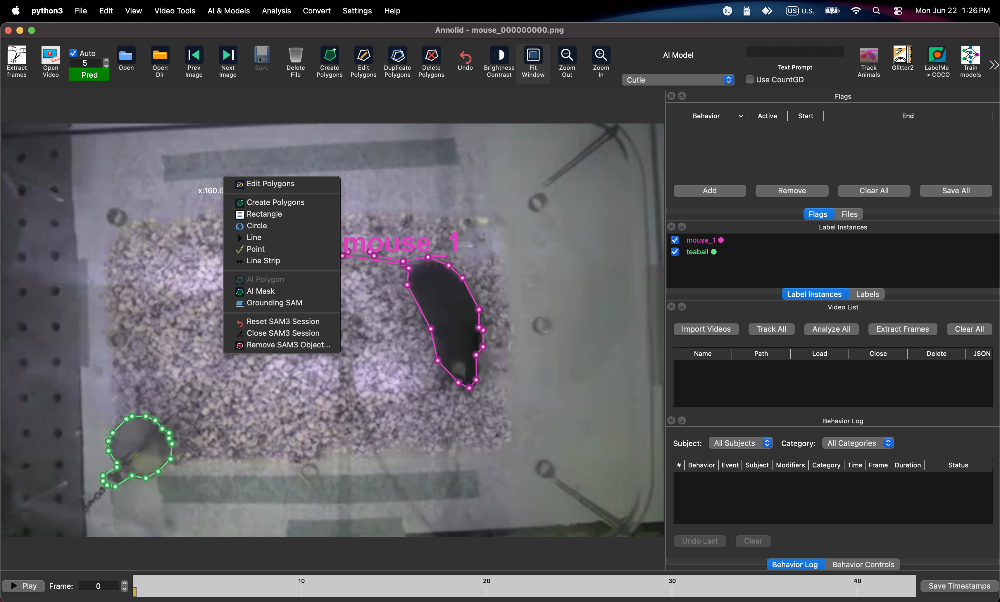

# Annolid

[](https://github.com/healthonrails/annolid/actions)
[](https://github.com/healthonrails/annolid/releases/latest)
[](https://zenodo.org/badge/latestdoi/290017987)
[](https://pepy.tech/project/annolid)
[](https://arxiv.org/abs/2403.18690)

> Annotate, segment, track, and analyze animals in research videos.

Annolid brings image and video annotation, instance segmentation, multi-animal tracking, keypoint tracking, and behavior analysis into a desktop application with companion command-line tools. Start with a representative labeled frame, track or propagate annotations, review difficult moments, and export results for analysis.

[User guide](https://annolid.com) · [Getting started](docs/getting_started.md) · [Tutorials](docs/tutorials.md) · [Report an issue](https://github.com/healthonrails/annolid/issues) · [YouTube](https://www.youtube.com/@annolid)



**See it in action:** [Tracking four interacting mice with one labeled frame — a 10-minute experiment](https://youtu.be/PNbPA649r78).

## Table of Contents

- [What You Can Do](#what-you-can-do)
- [Quick Start](#quick-start)
- [Your First Tracking Session](#your-first-tracking-session)
- [Installation Options](#installation-options)
- [Command-Line Workflows](#command-line-workflows)
- [Annotation and Data](#annotation-and-data)
- [Tutorials and Specialized Workflows](#tutorials-and-specialized-workflows)
- [Troubleshooting and Support](#troubleshooting-and-support)
- [Citing Annolid](#citing-annolid)
- [Publications](#publications)
- [Additional Resources](#additional-resources)
- [Acknowledgements](#acknowledgements)
- [Contributing](#contributing)
- [License](#license)

## What You Can Do

| Goal | Annolid workflow |
| --- | --- |
| Annotate images and videos | Draw polygons, boxes, keypoints, and zones; save LabelMe-compatible annotations. |
| Track multiple animals | Use labeled seed frames with segmentation and tracking models, then review masks and identities. |
| Follow body parts | Propagate named keypoints with DINOv3, TAPNext ONNX, or CoWTracker workflows. |
| Score and analyze behavior | Record events with Timeline and Flags; export time budgets, bout counts, and zone metrics. |
| Run reproducible model jobs | Train, predict, and evaluate through model plugins with `annolid-run`. |
| Work with large images | Use optional tiled TIFF backends and atlas overlays. |
| Use an assistant in the GUI | Open Annolid Bot for multimodal assistance, model execution, and optional tool integrations. |

Model backends and integrations have different dependency and hardware requirements. Follow the linked [workflow guides](docs/workflows.md) before installing optional features.

## Quick Start

The one-line installer sets up a source checkout and an isolated environment. Its default `gui` profile includes the GUI, machine-learning runtime, and common tracking dependencies (`ml,tracking,cutie`).

### macOS / Linux

```bash
curl -sSL https://raw.githubusercontent.com/healthonrails/annolid/main/install.sh | bash
```

### Windows PowerShell

```powershell
irm https://raw.githubusercontent.com/healthonrails/annolid/main/install.ps1 | iex
```

### Launch and update

After a successful default venv installation, open the install folder printed by the installer:

| Platform | Launch Annolid | Update Annolid |
| --- | --- | --- |
| macOS | `Launch Annolid.command` | `Update Annolid.command` |
| Windows | `Launch Annolid.cmd` | `Update Annolid.cmd` |
| Linux | `Launch Annolid.desktop` | `Update Annolid.desktop` |

These shortcuts activate the environment for you. Linux may require marking the `.desktop` file as trusted; the adjacent `.sh` launcher also works from a terminal. For a manual launch, use the environment activation command printed by the installer, then run `annolid`.

Before updating, save your annotations and close Annolid. Update shortcuts reuse your install choices and follow the checkout's source branch. See [launch and update details](docs/installation.md#launch-and-update-without-activating-an-environment) for update behavior and recovery guidance.

## Your First Tracking Session

1. **Open a short video** in Annolid. You can annotate video directly; extracting frames first is optional.
2. **Choose a clear seed frame** and draw a polygon around each animal. Use stable instance names such as `mouse_1` and `mouse_2`.
3. **Save the annotations**, then run tracking or propagation from that frame using your selected model workflow.
4. **Review a short segment**, especially overlap, occlusion, and fast movement. Correct masks or identities where errors begin before processing a long recording.
5. **Save and export** the annotations or analysis outputs you need. Add behavior events or zones when they are part of your experiment.

The [Getting Started guide](docs/getting_started.md) walks through a first session. See [Core Workflows](docs/workflows.md) for tracking, correction, and export paths.

## Installation Options

Annolid requires **Python 3.10 or newer**; the default GUI/core workflow supports Python 3.10–3.14. Python 3.11 or 3.12 is a practical starting point for shared lab environments. Optional model backends may have additional requirements.

### Choose an installer profile

| Profile | Included extras beyond the GUI |
| --- | --- |
| `minimal` | Core annotation setup without optional model runtimes |
| `gui` (default) | `ml,tracking,cutie` |
| `workstation` | `tracking,sam3,training` |
| `full` | `all` |

For example, on macOS or Linux:

```bash
curl -sSL https://raw.githubusercontent.com/healthonrails/annolid/main/install.sh | bash -s -- --profile workstation
```

See [One-Line Installer Choices](docs/one_line_install_choices.md) for Windows profile selection, CPU/GPU options, custom paths, and non-interactive installation.

### Install into an existing Python environment

Activate your environment first, then install the GUI:

```bash
python -m pip install "annolid[gui]"
annolid
```

The package extra `[gui]` installs the Qt binding; it is smaller than the one-line installer's default `gui` profile. To include the same model extras explicitly:

```bash
python -m pip install "annolid[gui,ml,tracking,cutie]"
```

The installer also handles ONNX Runtime provider selection. For manual GPU setup, Conda, and the full extras list, follow the [Installation guide](docs/installation.md).

### Develop from source

With Git and `uv` available:

```bash
git clone --recurse-submodules https://github.com/healthonrails/annolid.git
cd annolid
uv venv .venv --python 3.11
uv pip install --python .venv -e ".[gui]"
```

Activate the environment before launching Annolid or running checks:

```bash
# macOS / Linux
source .venv/bin/activate
annolid
```

```powershell
# Windows PowerShell
.\.venv\Scripts\Activate.ps1
annolid
```

Add extras needed for your work, such as `.[gui,ml,tracking,cutie]`. See [uv Setup](docs/install_with_uv.md) and [Contributing](CONTRIBUTING.md) for more details.

## Command-Line Workflows

Run these commands in the environment where Annolid is installed:

```bash
annolid --help
annolid-run --help
annolid-run list-models
annolid-run help train
annolid-run help predict
```

For model-specific options, use `annolid-run help train <model>` or `annolid-run help predict <model>`, replacing `<model>` with a plugin name from `list-models`. Supported training plugins can use the [YAML run-config templates](annolid/configs/runs); explicit CLI flags override those settings.

For example, summarize exported behavior events in 60-second bins using your project schema:

```bash
python -m annolid.behavior.time_budget exported_events.csv \
    --schema project.annolid.json \
    --bin-size 60 \
    -o time_budget.csv
```

See [CLI Model Workflows](docs/workflows.md#3-cli-model-workflow) and [Annolid Agent and annolid-run](docs/agent_annolid_run.md) for model execution and automation.

## Annotation and Data

- **Keep names consistent.** Use stable animal identities and body-part names such as `nose` and `tail_base`. Define behavior labels before scoring and use the same definitions across annotators.
- **Review tracking separately from training.** A seed frame can initialize propagation; training a model across animals or recordings requires representative examples. Choose annotation volume based on reviewed results rather than a fixed frame count.
- **Keep video-frame JSON and PNG files together.** By default, video annotations store the image in a sidecar PNG instead of embedding it in every JSON. Set `store_video_frame_data: true` when self-contained frame JSON is required.
- **Customize labels and flags.** Use `annolid --labels /path/to/labels.txt` or `annolid --flags "digging,rearing,grooming"`. Save changes with the GUI's Save action.
- **Adjust label colors for review.** Right-click a label in **Labels** or a shape in **Label Instances**, then select **Change color**. The preference is stored in app settings without changing LabelMe JSON files.
- **Configure defaults.** Annolid uses `~/.labelmerc` (`C:\Users\<username>\.labelmerc` on Windows). Supply a different configuration with `annolid --config /path/to/config.yaml`.

See the [annotation guide](annolid/annotation/labelme.md), [behavior labeling tutorial](docs/tutorials/behavior_timeline_flags_bot.md), and [zone analysis guide](docs/zone_analysis.md) for detailed controls and output formats.

## Tutorials and Specialized Workflows

| Workflow | Guide |
| --- | --- |
| Behavior events, Timeline, and Flags | [Behavior labeling](docs/tutorials/behavior_timeline_flags_bot.md) |
| Zones and assay summaries | [Zone Analysis](docs/zone_analysis.md) |
| Sparse body-part tracking | [DINOv3](docs/dinov3_keypoint_tracking.md), [TAPNext ONNX](docs/tapnext.md), [CoWTracker](docs/cowtracker.md) |
| SAM3 segmentation and tracking | [SAM3](docs/sam3.md) |
| Large TIFFs and atlas overlays | [Large Image Guide](docs/large_image_guide.md), [Atlas Overlay Workflow](docs/atlas_overlay_workflow.md) |
| Video depth estimation | [Video Depth Anything](docs/video_depth_anything.md) |
| Annolid Bot and external tools | [Agent and Automation](docs/agent_and_automation.md), [MCP](docs/mcp.md) |

Browse the [tutorial index](docs/tutorials.md) for notebooks and additional examples, or watch the [Annolid video playlist](https://www.youtube.com/playlist?list=PLYp4D9Y-8_dRXPOtfGu48W5ENtfKn-Owc).

## Troubleshooting and Support

| Symptom | First step |
| --- | --- |
| `annolid` command is not found | Use the launch shortcut or activate the environment printed by the installer. |
| `qtpy.QtBindingsNotFoundError` | In the active environment, run `python -m pip install "annolid[gui]"` (or `python -m pip install -e ".[gui]"` from a source checkout). |
| Video import/export or codec errors | Check FFmpeg availability and try a short sample video; see [installation notes](docs/installation.md#common-post-install-notes). |
| A model or integration is unavailable | Check its workflow guide for required extras and checkpoints; inspect CLI options with `annolid-run help predict <model>`. |
| ONNX Runtime GPU validation fails | Activate the installer-created environment and follow the repair command printed by the installer. |
| An update stops on local edits or Git history | Follow the [update recovery guidance](docs/installation.md#launch-and-update-without-activating-an-environment), then rerun the update shortcut. |

For help, join the [Annolid Google Group](https://groups.google.com/g/annolid). For bugs or feature requests, [open an issue](https://github.com/healthonrails/annolid/issues) with your OS, Python and Annolid versions, installation method, reproduction steps, and the exact error or traceback.

## Citing Annolid

If you use Annolid in your research, please cite:

- **Preprint:** [Annolid: Annotation, Instance Segmentation, and Tracking Toolkit](https://arxiv.org/abs/2403.18690)
- **Zenodo:** Find the latest release DOI via the badge at the top of this README.

```bibtex
@misc{yang2024annolid,
      title={Annolid: Annotate, Segment, and Track Anything You Need},
      author={Chen Yang and Thomas A. Cleland},
      year={2024},
      eprint={2403.18690},
      archivePrefix={arXiv},
      primaryClass={cs.CV}
}

@article{yang2023automated,
  title={Automated Behavioral Analysis Using Instance Segmentation},
  author={Yang, Chen and Forest, Jeremy and Einhorn, Matthew and Cleland, Thomas A},
  journal={arXiv preprint arXiv:2312.07723},
  year={2023}
}

@misc{yang2020annolid,
  author = {Chen Yang and Jeremy Forest and Matthew Einhorn and Thomas Cleland},
  title = {Annolid: an instance segmentation-based multiple animal tracking and behavior analysis package},
  howpublished = {\url{https://github.com/healthonrails/annolid}},
  year = {2020}
}
```

## Publications

- **2022 – Ultrasonic vocalization study.** Pranic *et al.* relate mouse pup vocalizations to non-vocal behaviors ([bioRxiv](https://doi.org/10.1101/2022.10.14.512301)).
- **2022 – Digging and pain behavior.** Pattison *et al.* link digging behaviors to wellbeing in mice (*Pain*, 2022).
- **SfN Posters:**
  - [2021: Annolid — instance segmentation-based multiple-animal tracking](https://youtu.be/tVIE6vG9Gao)
  - 2023: PSTR512.01 *Scoring rodent digging behavior with Annolid*
  - 2023: PSTR512.02 *Annolid: Annotate, Segment, and Track Anything You Need*
- For more applications and datasets, visit [https://cplab.science/annolid](https://cplab.science/annolid).

## Additional Resources

- **Example dataset (COCO format):** [Download from Google Drive](https://drive.google.com/file/d/1fUXCLnoJ5SwXg54mj0NBKGzidsV8ALVR/view?usp=sharing).
- **Pretrained models:** Available in the [shared Google Drive folder](https://drive.google.com/drive/folders/1t1eXxoSN2irKRBJ8I7i3LHkjdGev7whF?usp=sharing).
- **Feature requests & bug reports:** Open an issue at [github.com/healthonrails/annolid/issues](https://github.com/healthonrails/annolid/issues).
- **Additional videos:** Visit the [Annolid YouTube channel](https://www.youtube.com/@annolid) for demonstrations and talks.

## Acknowledgements

Annolid's tracking module integrates **Cutie** for enhanced video object segmentation. If you use this feature, please cite *Putting the Object Back into Video Object Segmentation* (Cheng *et al.*, 2023) and the [Cutie repository](https://github.com/hkchengrex/Cutie).

The counting tool integrates **CountGD**; cite the original CountGD publication and repository when you rely on this module in your research.

## Contributing

Contributions are welcome! Review the [contribution guidelines](CONTRIBUTING.md) and [engineering standard](AGENTS.md), open an issue to discuss major changes, and run relevant tests before submitting a pull request.

## License

Annolid is distributed under the [Creative Commons Attribution-NonCommercial 4.0 International License](LICENSE).
