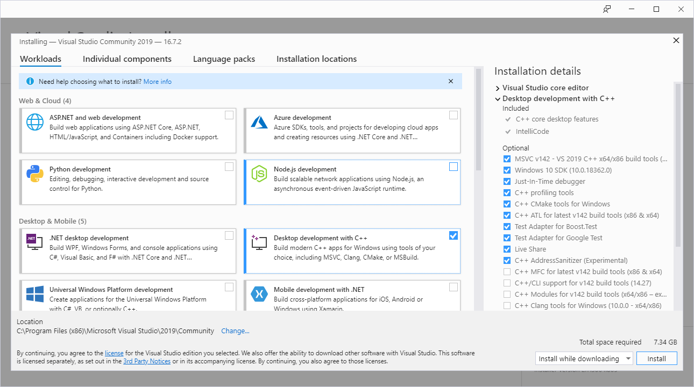

# Annotate Images and Videos

## Introduction
There are many free and open source image and video annotation tools that can be used with Annolid.  Here we describe one recommended Python tool, [labelme](https://github.com/wkentaro/labelme), by Kentaro Wada. 

The overall workflow is to first take a video file and extract a number of frames from it as JPEG files, using [Annolid's extraction tool](https://github.com/healthonrails/annolid) or another tool or service.  Once you have a directory (folder) full of JPEGs, follow the instructions on this page to (1) label each frame using Labelme, producing a .json metadata file for each frame, and (2) convert a set of these labels into COCO format for use in training the Annolid network.  

## Installation

Navigate to your projects directory, or wherever you intend to install labelme.

```bash
git clone https://github.com/wkentaro/labelme.git
cd labelme
pip install -e .
```
For more information, please consult the installation instructions in the [Labelme Github repo](https://github.com/wkentaro/labelme). 

## Labels File

Create a **labels.txt** file that contains all the annotation labels that you intend to use on a given set of video files.  This file can live wherever is most convenient for you; one good choice is in the directory that contains all of the (similar) videos that you intend to label, all of which presumably will be labeled with the same set of labels.   An example of such a file is:

```
__ignore__
_background_
mouse
body
body_centroid
left_ear
right_ear
nose
head
hand
arm
wall
corner
base_of_tail
grooming
rearing
object_investigation
```

## *Optional*:  Extract video frames for labeling

Using the [Annolid frame extraction tool](https://github.com/healthonrails/annolid), or another selective frame extraction tool, is recommended.  But, if you prefer, you also can extract *all* of the frames from a video *my_video.mp4* as JPEG files using a labelme tool.    

```
cd labelme`
python video_to_images my_video.mp4
```

Whatever technique you use, you should end up with a directory containing all extracted frames as JPEGs.  Generally this directory should bear the same name as the video file from which the frames were extracted (here:  *my_video*)

## Use *labelme* to label video frames

For a folder named *my_video*, full of JPEGs, and a labels file named *labels.txt*:  

```
cd labelme
labelme my_video --labels labels.txt
```
This will start up the labelme GUI, enabling you to go through each JPEG frame in turn and label the relevant features within each frame according to your goals.  You will see the list of labels from labels.txt in the labelme GUI, along with the first frame in the directory.  

For information on just how to use labelme to label frames, please consult the instructions and tutorials on the [Labelme Github page](https://github.com/wkentaro/labelme), and the provided [video annotation examples]( https://github.com/wkentaro/labelme/tree/master/examples/video_annotation). 

Saving the annotations made on each frame will produce a corresponding .json metadata file -- one for each JPEG -- in the same directory as the JPEGs themselves.  

## *Optional*:  visualize and check the labeled frames

This labelme tool can be used to quickly check the labeling of single .json files.  

```bash
cd labelme
labelme_json_to_dataset xxxxxxxxx.json

```


## Convert the labeled frames into COCO format

After labeling is complete, this tool will take all of the JPEG frames, .json metadata, and label.txt information in a designated directory (here: *input_dir*) and convert these data into COCO format in a different directory (*output_dir*).  (The COCO-formatted data in *output_dir* then will be used by Annolid for training instance segmentation models). 

```bash
cd labelme
python examples/instance_segmentation/labelme2coco.py --labels labels.txt input_dir output_dir
```

where input_dir might be *my_video* and output_dir might be *my_video_coco*.  

NOTE:  If you encounter problems running `labelme2coco.py` on Windows or installing its dependencies, see Appendix 1 below for a solution.  


## Appendices

#### 1. Special issues installing labelme on Windows

When using Anaconda under Windows, running `labelme2coco.py` for the first time will request that the  `pycocotools` dependency be installed.  As of this writing, there is no conda package for `pycocotools`, so PIP must be used:

```
pip install pycocotools
```

The package and several dependencies should download fine; however, installation will fail if there is no C++ compiler available.  Specifically, the installer will request Microsoft Visual C++ 14.0.  To acquire and install this, first [download VisualStudio](https://visualstudio.microsoft.com/downloads/).  The free community version is fine (as of this writing, Visual Studio 2019 is current, and works fine for present purposes).  Once the installer is running, select "Desktop development with C++" as shown below for installation.  Nothing else is necessary (though even this will take up about 2 GB of drive space).  Once this is installed, and the computer rebooted, you should be able to install `pycocotools` and then run `labelme2coco.py`.  




If you have more complicated problems installing `pycocotools` under Windows, see [this discussion](https://github.com/cocodataset/cocoapi/issues/169).


#### 2. How to preserve annotations from the previous frame in labelme

Click **Edit** -> **Keep Previous Annotation**


#### 3. Useful labelme keyboard shortcuts

`D` : Next Image
`A` : Prev Image

