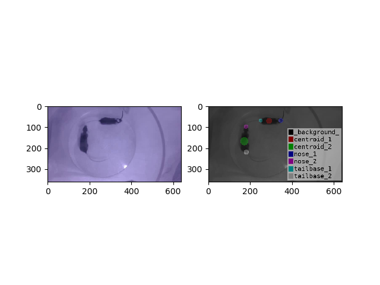
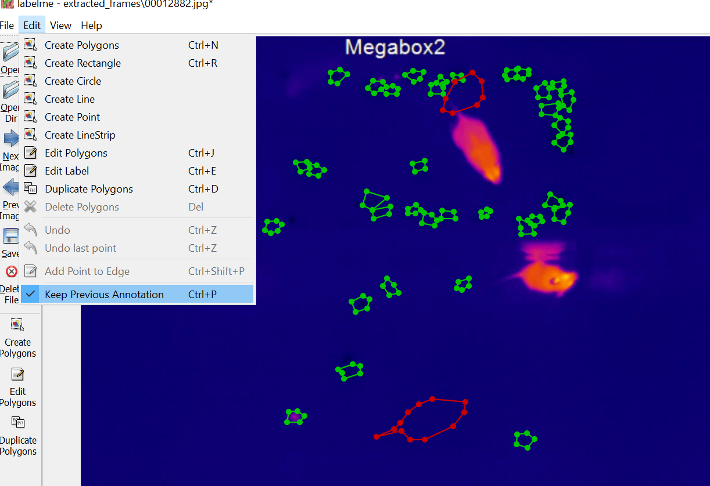

# Annotate Images and Videos

## Introduction
There are many free and open source image and video annotation tools. [Labelme](https://github.com/wkentaro/labelme) is written in Python and inspired by http://labelme.csail.mit.edu. 

## Installation

```bash
git clone https://github.com/wkentaro/labelme.git
cd labelme
pip install -e .
```
For more information, please check the instation section in the Labelme github repo https://github.com/wkentaro/labelme. 

Create a labels.txt file, it contains all the annotation labels.
```
__ignore__
_background_
mouse
body
body_centroid
left_ear
right_ear
nose
head
hand
arm
wall
corner
base_of_tail
grooming
rearing
object_investigation
```

## Label video frames
```
cd labelme
python video_to_images my_video.mp4
labelme my_video --labels labels.txt
```
For more information, please check the video annotation examples: https://github.com/wkentaro/labelme/tree/master/examples/video_annotation. 

## Visualize and check the labeled frames

```bash
cd labelme
labelme_json_to_dataset xxxxxxxxx.json

```


## Convert the labeled frames into COCO format

```bash
cd labelme
python examples/instance_segmentation/labelme2coco.py --labels labels.txt input_dir output_dir
```

The dataset in the output_dir is converted into COCO format for training instance segemenation models. 

## Keep annotations frome the previous frame
Click **Edit** -> **Keep Previous Annotation**



## Useful keyboard shortcuts
`D` : Next Image
`A` : Prev Image