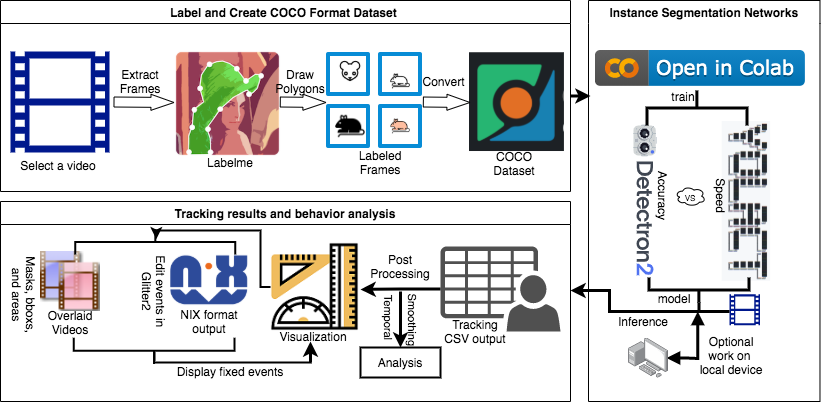

# High level overview

A high level overview of its workflow consists in the following steps:

1. Labeling of frames (annotation) & COCO formatting

2. Training (fine-tuning) and inference (local worstation or Google Colab)

3. Post-processing and analysis

# Accessibility and efficiency

- Options for training on Google Colab (as well as on a local workstation)
- Fast training with quality- and speed-optimized options
  - Model training :
      - 200 labeled images
      - < 2 hours for 3000 iterations on Colab
      - 30 min on NVidia 1080Ti
  - Inference (applying trained model to behavior videos)
      - Mask R-CNN: ~7 FPS
      - YOLACT: ~30 FPS
- Transfer learning based on existing models trained on COCO dataset improves performance
- Capacities for autolabeling and human-in-the-loop iterative model training
