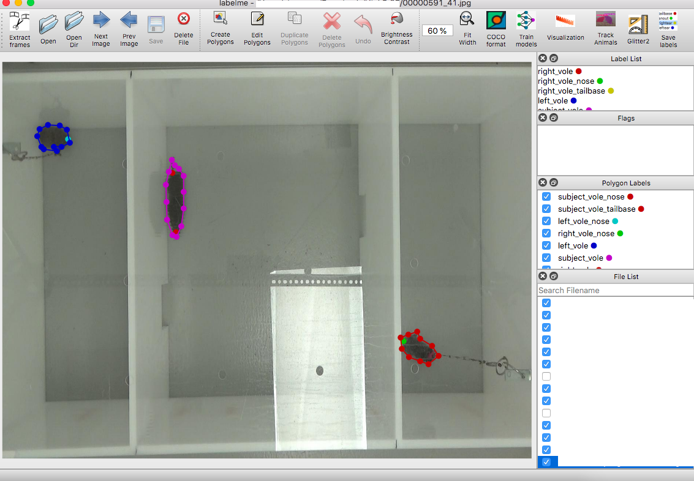

# Labeling Instances

## Effortless Object Labeling with Minimal Points: Automated Polygon Generation using Segment Anything Models


## What should you label ?
Due to Annolid using an instance segmentation approach, it is very versatile in what you want to label. We use polygons & keypoints to label region of interest (e.g. Vole_1, Mouse_1, Mouse_2, Frog, tail_base, nose...) or to capture interesting behaviors or feature (e.g. rearing, social_interaction, urine_sample ...).

Here is an example image :



Labeling is done on a frame-by-frame basis. We'll show you how to label zones in a given frame. Start the Annolid GUI. Click the 'Open dir' button and select the directory where you exported your images in the previous [step](extract_frames). All the extracted images are shown in File List in the bottom right. Select the first image you want to annotate. Click the 'Create Polygon' button and delineate the structure/zone you want to label. When you finish labeling your zone, you can give it a name that will appear in the 'Polygon Labels'. Repeat until all the desired zones are labeled. You can adjust or delete the polygons by clicking on the 'Edit Polygon' button. Then click the polygon to be edited and directly edit the nodes. If you want to delete it, once you selected it, just click the 'delete Polygon' button.
When done, save the zone information to a json file by clicking the Save icon.

```{note}
If you need to delineate something other than a polygon (for example a keypoint), right click on the image and click 'Create Point'. You can also create Rectangle, Circle, Line or LineStrip.
```

# Save Labels

In the previous [step](labelling_images), we delineated zones and their associated labels. Those labels need to be saved using the 'Save Labels' button.

```{note}
You can manually edit those labels by opening the label file and adding/removing labels. They will then appear inside the GUI.
```

```{warning}
If you manually edit the label file, do not remove the first 2 lines '\_\_ignore\_\_' and
'\_background\_'
```

Here is a video to guide you through the process:

<figure class="video_container">
  <iframe width="720" height="480" src="https://www.youtube.com/embed/pb8X4bqLRZ0" frameborder="0" allowfullscreen="true"> </iframe>
</figure>


To help guide you through the process we made the following video:

<figure class="video_container">
  <iframe width="720" height="480" src="https://www.youtube.com/embed/zX8cUImRI_s" frameborder="0" allowfullscreen="true"> </iframe>
</figure>


Depending on your behavioral apparatus and overall configuration, Annolid might need very few images to perform accurate instance segmentation. We recommend as a first pass to label ~100 frames.


## Tracking and re-identification
To link instances across frames, we treat each instance as its own class across frames.
So if you want
- **to track multiple animals** : you need to label each animal as a separate instance (Vole_1, Vole_2 ...).
- **to generalize recognition across animals or videos** : you need to label multiple animals as examples of the same instance (Vole).


Video example courtesy of Lindsay Sailer and Alex Ophir:

<figure class="video_container">
  <iframe width="720" height="480" src="https://drive.google.com/file/d/1uw_0JO_rB6Adq7YEHrapzDdGEOPxsmhC/preview" frameborder="0" allowfullscreen="true"> </iframe>
</figure>
