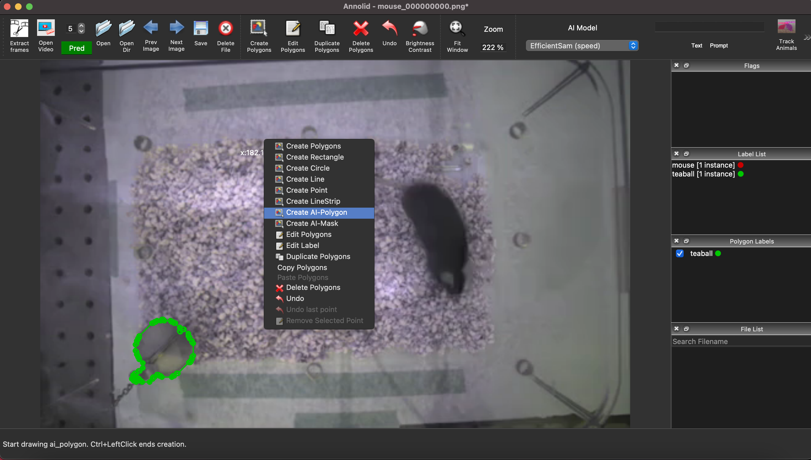
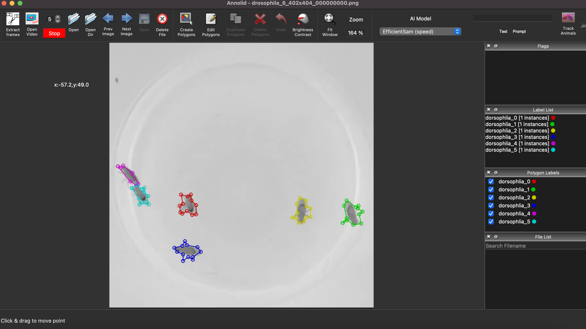

# Tracking with Cutie

## A Quick Start to Tracking with Annolid

This short guide will get you started using Annolid to track animals or other objects in your videos. It is only a starting point, in which we illustrate the semiautomated segmentation of user-specified objects followed by Cutie-based automatic tracking predictions.

For further details about Annolid's new (2024) SAM/Grounding DINO-based automatic segmentation coupled with Cutie-based automatic tracking, consult [Yang et al., 2024](https://arxiv.org/abs/2403.18690). For some of Annolid's diverse other behavioral analysis applications, consult [Yang et al., 2023](https://arxiv.org/abs/2312.07723) and [Fang et al., 2023](https://confluence.cornell.edu/download/attachments/89461995/2023_SFN_Ray_final.pdf?version=1&modificationDate=1709845356175&api=v2).

## Step 1: Open your video and label instances in one frame

Start by opening Annolid and loading the video you want to work with. You can do this by clicking on the *Open Video* icon in the toolbar or selecting "Open Video" from the File menu.

*Figure: Opening a video and selecting the AI-Polygon tool*

Once the video is loaded, navigate to the first frame in which all of your animals and other objects of interest appear. Right-click to bring up the floating menu and choose "AI-Polygon" (Figure 1). (This tool uses Meta's Segment Anything Model to automagically outline most common objects so that you don't have to manually draw the outlining polygon, though you can do so if you prefer). Click on the object you want to track, and Annolid will generate a polygon around it. You then can manually adjust the polygon as needed and assign a unique identifier to the instance. Clicking on an object while holding down the Control (Command) key will bring up a pop-up dialog (Figure 2) in which you can enter the information for each instance.

When labeling is complete, use Control-S (Command-S) or click on the toolbar Save button to save the labeled instances to a JSON file.

*Figure: Labeling instances in Annolid (control-click)*

## Step 2: Start automatic predictions (tracking) based on the first frame

After labeling the first frame, it's time to start tracking! Select "Cutie" from the AI Model pulldown menu and click on the green "Pred" button to initiate the tracking process. Annolid will run its model inference in the background, and you can check its predictions in real time by navigating through the completed frames using the slider at the bottom of the screen.

*Figure: Tracking underway in Annolid*

## Step 3: Verify Annolid's predictions and correct if necessary

If you notice any inaccuracies in Annolid's predictions, you can stop the prediction process by clicking the red "Stop" button (Figure 3). Once prediction has been paused, navigate to the first incorrectly segmented frame, make corrections as needed (Figure 4), and restart predictions ("Pred" button). Annolid will make new predictions from that point forward.

*Figure: Pausing and correcting predictions in Annolid*

## Step 4: Finalize the predictions

Once you are satisfied with the tracking, you can finalize the predictions (Figure 5). Annolid makes it easy to review and complete the tracking task, ensuring accuracy and reliability.

*Figure: Completing the tracking process in Annolid*

Congratulations! You've successfully used Annolid to track objects in your videos. Your tracking results will be saved to a folder with the same name as the video. This folder will contain all the JSON files following the convention 'video_name_frame_number.json', as well as two summary CSV (spreadsheet) files following the filename conventions 'video_name_tracking.csv' and 'video_name_tracked.csv'. More details are available in our published works (see *References* below) and in the online Annolid documentation linked from [annolid.com](https://annolid.com).

## References
- [1] C. Yang and T. A. Cleland, “Annolid: annotate, segment, and track anything you need,”
arXiv:2403.18690, 2024.
 - [2] C. Yang, J. Forest, M. Einhorn, and T. A. Cleland, “Automated behavioral analysis using
instance segmentation,” arXiv:2312.07723, 2023.
- [3] J. Fang, C. Yang, and T. A. Cleland, “Scoring rodent digging behavior with Annolid,” Soc.
Neurosci. Abstr. 512.01, 2023.
13
