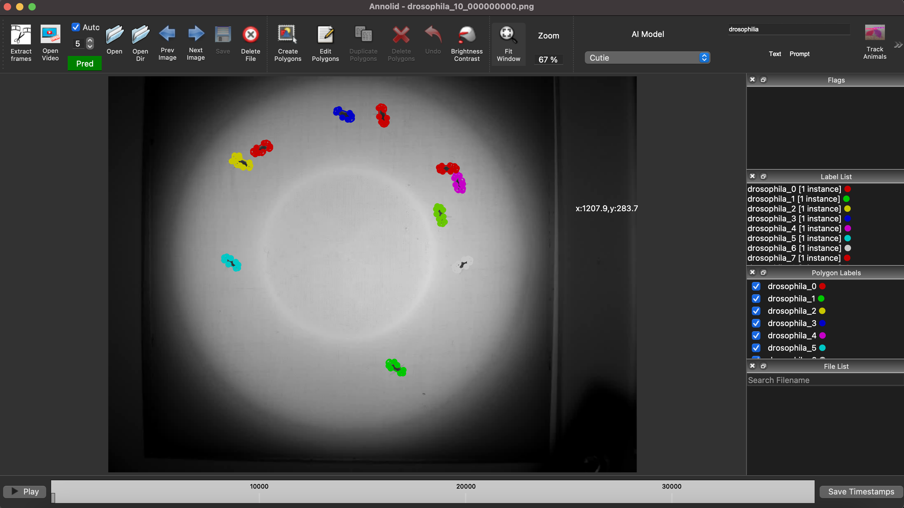

# Batch downsampling with sequential video review

This tutorial shows the recommended way to process a folder of videos when most files share the same settings but a few need custom crops or other adjustments.

The main dialog now uses four tabs:

1. `Input / Output` selects the source folder and output folder.
2. `Processing` contains the shared defaults for the whole folder and the per-video review entry point.
3. `Summary` shows a quick review of the current batch before you run it.
4. `Run` starts processing and shows progress.

## Review dialog callouts

The review dialog walks through one video at a time.

1. `Current video:` shows the file you are configuring.
2. `Video 1 of N` shows where you are in the folder.
3. `Load Folder Defaults` resets the current video fields to the batch defaults.
4. `Scale Factor:` set a different resize factor for just this video.
5. `Frames Per Second (FPS):` leave this blank to keep the source FPS, or enter a fixed value for the selected file.
6. `Apply Denoise`: enable denoising only for this file.
7. `Auto Contrast Enhancement`: enable contrast correction only for this file.
8. `Auto Contrast Strength:` tune how strong the contrast correction should be.
9. `Enable Crop Region`: turn on a custom crop for this file.
10. `Crop Region (x, y, width, height):` enter the exact crop rectangle.
11. `Preview Crop On Current Video`: open the first frame and draw a crop visually.
12. `Previous`: move back to the previous video.
13. `Skip`: keep the folder defaults for the current video and move on.
14. `Save & Next`: store the current settings for the current video and move on.
15. `Finish`: save the current video if needed and close the review dialog.
16. `Cancel`: discard review changes and close the dialog.

The dialog updates the current video label and the custom-override count as you move through the folder.

## When to use this workflow

Use this approach when:

- the videos come from the same experiment,
- most of them should share one scale factor and one FPS policy,
- one or two videos need a different crop or a different output setting,
- you want a record of the effective settings for each output file.

## What the workflow gives you

- Folder-wide defaults for common settings.
- A linear review pass for exceptions.
- Interactive crop preview for any selected video.
- A processing report for each output video.

## Step-by-step

### 1. Open the tool

In Annolid, choose **`File` > `Downsample Videos`**.

### 2. Select your folder

Choose the folder that contains the input videos.

Set an output folder now so the processed files stay separate from the originals.

If you leave the output folder blank, Annolid creates a sibling folder with `_downsampled` appended to the input folder name.

### 3. Set the folder defaults

Use the main dialog to set the values that should apply to almost every video:

- scale factor,
- optional fixed FPS,
- denoise,
- auto contrast,
- shared crop region, if the same crop applies to the whole folder.

If you have only one video, you can stop here and run processing directly.

### 4. Review videos one by one

Open the **`Processing`** tab and click **`Review Videos One by One (Folder Input)`**.

For each video:

1. Change only the fields that should differ from the folder defaults.
2. Use **`Preview Crop On Current Video`** when you need to draw a crop visually.
3. Click **`Save & Next`** to store a custom override and move forward.
4. Click **`Skip`** to keep the folder defaults for that video and move forward.

Use **`Previous`** if you need to correct an earlier video.

### 5. Run the batch

Back in the main dialog:

- check **`Rescale Video`**,
- optionally check **`Collect Metadata Only`**,
- click **`Run Processing`**.

Annolid runs through the videos one by one and applies the right settings for each file.

## Processing order

The tool applies settings in this order:

1. Start with the folder defaults.
2. Replace them with any selected video's saved review settings.
3. Run FFmpeg for that one file.
4. Write the report for that output video.
5. Move to the next file.

That order matters because it keeps the output deterministic and the reports easy to audit.

## Good practices

- Start with conservative folder defaults.
- Save only the files that truly differ.
- Skip the files that should stay on the batch default.
- Use one output directory per run.
- Review the generated `.md` reports if you need to reproduce or audit a batch later.

## Example

Suppose you have 12 videos from one experiment.

- 11 videos should be scaled to `0.5` and cropped to the same arena region.
- 1 video was recorded from a different camera and needs a custom crop.

The clean workflow is:

1. Set the `0.5` scale and the shared crop in the main dialog.
2. Open the review dialog.
3. Review the 11 normal videos and click **`Skip`** for each one.
4. Change only the outlier video's crop.
5. Click **`Save & Next`** for that file.
6. Run the batch.
