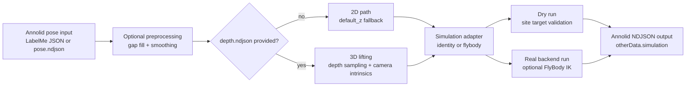

# Simulation and FlyBody

This page documents the current Annolid simulation workflow, with FlyBody as
the first concrete backend.

Simulation support is additive and optional. Default Annolid GUI/CLI workflows
continue to work without FlyBody, MuJoCo, or `dm_control`.

## Workflow Diagram



## What Exists Today

Annolid now supports:

- backend-neutral simulation IO through `annolid.simulation`,
- a built-in `simulation_runner` plugin for contract validation,
- a built-in `flybody` plugin for FlyBody-oriented mappings and outputs,
- optional depth-assisted 2D-to-3D lifting from Annolid `depth.ndjson`,
- temporal preprocessing before fitting:
  - gap filling,
  - EMA smoothing,
  - One Euro smoothing,
  - Kalman smoothing.

The current FlyBody path is designed to stay import-light. If FlyBody,
`dm_control`, or MuJoCo are not installed, `--dry-run` still works so you can
validate mappings and output contracts.

## Runtime Setup with `uv`

Use a repository-local `.venv` and install the optional FlyBody stack with
`uv pip`, not whatever global `pip` happens to resolve to:

```bash
uv venv .venv --python 3.11
source .venv/bin/activate
uv pip install --python .venv/bin/python -e ".[gui]"
uv pip install --python .venv/bin/python dm-control mujoco dm-tree mediapy h5py
uv pip install --python .venv/bin/python --no-deps -e /path/to/flybody
python scripts/check_flybody_runtime.py
```

Or use the repo helper:

```bash
scripts/setup_flybody_uv.sh --flybody-path /path/to/flybody
```

To keep your current `.venv` untouched, point to a separate environment:

```bash
scripts/setup_flybody_uv.sh --venv-dir .venv311 --python 3.11 --flybody-path /path/to/flybody
```

Practical notes:

- Python 3.10 to 3.12 is the cleanest FlyBody target today.
- Python 3.13 can still require a local `labmaze` compatibility workaround.
- `--no-deps` on the editable FlyBody install keeps Annolid in control of the
  already-installed runtime packages inside `.venv`.
- `scripts/check_flybody_runtime.py` verifies import resolution and FlyBody
  environment creation before you run the Annolid plugin.
- `scripts/setup_flybody_uv.sh` wraps the same setup flow for a local FlyBody
  checkout.

## Core Commands

Discover the plugins:

```bash
annolid-run list-models
annolid-run help predict simulation_runner
annolid-run help predict flybody
```

## 1. Start From the Checked Template

Annolid ships a checked example config:

```bash
annolid/configs/flybody_template.yaml
```

Use it directly or copy it into your project and edit the site names to match
your FlyBody model.

Template fields:

- `keypoint_to_site`: Annolid keypoint label to FlyBody site name
- `site_to_joint`: optional site-to-joint lookup for diagnostics
- `coordinate_system.camera_intrinsics`: used for depth-assisted 3D lifting
- `metadata`: notes, provenance, and project-specific hints

## 2. Generate a Project-Specific Template

If you already have a pose schema, generate a mapping template from it:

```bash
annolid-run predict flybody \
  --pose-schema pose_schema.json \
  --write-mapping-template flybody.yaml
```

If you do not have a pose schema yet, provide keypoints directly:

```bash
annolid-run predict simulation_runner \
  --backend flybody \
  --template-keypoints nose,thorax,abdomen_tip,left_front_leg_tip,right_front_leg_tip \
  --write-mapping-template flybody.yaml
```

## 3. Validate Mapping Without FlyBody Installed

Use `--dry-run` to convert Annolid keypoints into FlyBody-style site targets and
write Annolid-compatible NDJSON output:

```bash
annolid-run predict flybody \
  --input pose.ndjson \
  --mapping flybody.yaml \
  --out-ndjson flybody.ndjson \
  --dry-run
```

This writes simulation metadata under:

```text
otherData.simulation
```

## 3A. View FlyBody Output in the GUI

The Annolid GUI can now open simulation/FlyBody NDJSON directly in the embedded
Three.js viewer.

Menu path:

```text
View -> 3D Examples -> Open Simulation Output…
```

What it shows:

- 3D FlyBody site targets from `otherData.simulation.state.site_targets`
- per-frame playback with a scrubber
- short trajectory trails for each site
- optional skeleton edges from `mapping_metadata.metadata.viewer_edges`

The generic simulation viewer now also honors optional payload display flags, so
example payloads can suppress debug overlays like:

- point markers
- text labels
- skeleton edges
- trails

This is additive:

- regular Annolid 2D annotation still works unchanged
- generic Three.js mesh/point-cloud viewing still works unchanged
- FlyBody runtime is still optional; dry-run NDJSON is enough for visualization

If you do not already have simulation NDJSON, the GUI can run the workflow for
you:

```text
View -> 3D Examples -> Run Simulation to 3D Viewer…
```

That dialog accepts:

- pose input (`.json` or `.ndjson`)
- simulation mapping (`.json` / `.yaml`)
- optional depth sidecar
- optional pose schema
- backend choice (`flybody` or `identity`)

The result is written to a temporary NDJSON path by default and opened
immediately in the Three.js viewer.

To inspect whether the optional FlyBody runtime is actually ready before
launching the example:

```text
View -> 3D Examples -> FlyBody Status…
```

The setup dialog reports:

- whether a local FlyBody repo was found
- which Python runtimes were checked
- whether each runtime can import FlyBody and create `walk_imitation()`
- and gives one-place actions to:
  - refresh status
  - open the FlyBody example
  - install or update FlyBody

Runtime discovery order currently prefers:

- `<flybody repo>/.venv/bin/python`
- `annolid/.venv311/bin/python`
- `annolid/.venv/bin/python`
- the current interpreter

## 3B. FlyBody Example Uses the Local Repo When Present

The `View -> 3D Examples -> FlyBody 3D Example` entry is now the fast path. It
opens the FlyBody mesh/example immediately and does not block on a live rollout.

If you want the expensive runtime-backed path, use:

```text
View -> 3D Examples -> Start Live FlyBody Simulation…
```

The live action remains optional and can take longer because it generates a
real FlyBody rollout first.

The FlyBody 3D example still prefers a real local FlyBody checkout for mesh
assets.

Resolution order:

- `ANNOLID_FLYBODY_PATH`
- `~/Downloads/flybody`

When found, Annolid:

- reads `flybody/fruitfly/assets/fruitfly.xml`
- reads `flybody/fruitfly/assets/floor.xml`
- combines the referenced OBJ meshes into a temporary assembled fly mesh
- loads the FlyBody floor plane into the Three.js scene
- opens a clean presentation view:
  - assembled fly body
  - floor/grid
  - walking loop animation
  - no point markers, label text, edges, or trails in the static example
- checks the optional FlyBody runtime in `.venv311`, `.venv`, and the current
  interpreter
- if a usable FlyBody runtime is available, runs a live `walk_imitation()`
  rollout and opens that real site-state playback in the 3D viewer
- `Start Live FlyBody Simulation…` now opens the static FlyBody 3D example
  immediately, then replaces it with the live rollout when that background job
  finishes
- when the local repo mesh is available, the viewer now loads FlyBody body-part
  meshes and applies per-body MuJoCo poses for articulated playback
- FlyBody body parts also receive stable material categories and colors
  (thorax, head, wings, antennae, abdomen, legs, mouthparts) for clearer 3D
  structure during playback
- the 3D viewer now includes:
  - a part legend
  - per-category visibility toggles so you can hide wings, legs, antennae,
    abdomen, or other body groups while scrubbing playback
- if the runtime is not available, falls back to the bundled example playback
  while still using the real fly mesh when the repo is present

If no local FlyBody checkout is available, the example still opens using the
built-in skeleton-only fallback.

To install FlyBody from the GUI instead of doing it manually:

```text
View -> 3D Examples -> Install FlyBody…
```

That action:

- clones FlyBody from GitHub if the checkout is missing
- runs `scripts/setup_flybody_uv.sh`
- keeps the setup opt-in and separate from normal Annolid workflows

If you already created a repo-local FlyBody environment, for example:

```bash
cd /path/to/flybody
uv venv --python 3.12
source .venv/bin/activate
uv pip install -e .
```

Annolid will now detect that repo-local `.venv` automatically in the FlyBody
status dialog and when launching the live FlyBody example.

## 4. Add Depth for 3D Targets

If you have already generated Annolid depth sidecars, pass them in directly:

```bash
annolid-run predict flybody \
  --input pose.ndjson \
  --depth-ndjson depth.ndjson \
  --mapping flybody.yaml \
  --out-ndjson flybody.ndjson \
  --dry-run
```

When `coordinate_system.camera_intrinsics` is populated in the mapping file,
Annolid lifts image coordinates into 3D camera coordinates. If intrinsics are
missing, Annolid falls back to:

```text
(x_px, y_px, depth)
```

Recommended intrinsics fields:

- `fx`
- `fy`
- `cx`
- `cy`

## 5. Smooth and Fill Small Gaps

Preprocess pose tracks before lifting or fitting:

```bash
annolid-run predict flybody \
  --input pose.ndjson \
  --depth-ndjson depth.ndjson \
  --mapping flybody.yaml \
  --out-ndjson flybody.ndjson \
  --smooth-mode ema \
  --max-gap-frames 2 \
  --fps 30 \
  --dry-run
```

Supported smoothing modes:

- `none`
- `ema`
- `one_euro`
- `kalman`

Practical defaults:

- use `--max-gap-frames 1` or `2` for short occlusions,
- start with `--smooth-mode ema`,
- only move to `kalman` when tracks are noisy enough to justify prediction.

## 6. Run the Backend-Neutral Validation Path

Use the lightweight `identity` backend when you want to test data flow without
FlyBody-specific assumptions:

```bash
annolid-run predict simulation_runner \
  --backend identity \
  --input pose.json \
  --mapping sim.json \
  --out-ndjson sim.ndjson
```

## 7. Move to Real FlyBody Runtime

The non-`--dry-run` path is already wired for optional backend imports and has
been validated locally against a FlyBody checkout in `.venv`:

```bash
annolid-run predict flybody \
  --input pose.ndjson \
  --depth-ndjson depth.ndjson \
  --mapping flybody.yaml \
  --out-ndjson flybody.ndjson \
  --ik-max-steps 4000
```

Current expectation:

- FlyBody must be installed separately.
- `dm_control` and MuJoCo must be available in the same environment.
- Run `python scripts/check_flybody_runtime.py` before the first real backend
  invocation if you changed the environment.
- You may need to override callable locations if your FlyBody checkout differs:

```bash
annolid-run predict flybody \
  --input pose.ndjson \
  --mapping flybody.yaml \
  --out-ndjson flybody.ndjson \
  --env-factory flybody.fly_envs:walk_imitation \
  --ik-function flybody.inverse_kinematics:qpos_from_site_xpos
```

## Output Contract

Simulation runs preserve Annolid NDJSON compatibility and add backend data to:

```text
otherData.simulation.adapter
otherData.simulation.state
otherData.simulation.diagnostics
otherData.simulation.run_metadata
otherData.simulation.mapping_metadata
```

This keeps simulation results usable by existing Annolid tooling while exposing
backend-specific metadata for downstream analysis.

## Optional Runtime Test Coverage

Run the optional real-runtime smoke test locally:

```bash
source .venv/bin/activate
ANNOLID_RUN_FLYBODY_RUNTIME=1 pytest -m simulation tests/test_flybody_runtime_optional.py
```

This is intentionally excluded from default test runs and is covered by the
optional GitHub Actions workflow:

```text
.github/workflows/simulation-optional.yml
```

That workflow uses a headless MuJoCo configuration (`MUJOCO_GL=osmesa`) so
default Annolid CI does not need simulator graphics dependencies.

## Minimal End-to-End Example

```bash
source .venv/bin/activate

annolid-run predict flybody \
  --pose-schema pose_schema.json \
  --write-mapping-template flybody.yaml

annolid-run predict flybody \
  --input pose.ndjson \
  --depth-ndjson depth.ndjson \
  --mapping flybody.yaml \
  --out-ndjson flybody.ndjson \
  --smooth-mode ema \
  --max-gap-frames 2 \
  --dry-run
```

## Current Limits

- A clean Python 3.13 FlyBody install is still weaker than Python 3.10 to 3.12
  because upstream `labmaze` packaging may require a local workaround.
- Depth lifting currently uses nearest-pixel sampling.
- Multi-view lifting and camera extrinsics are not implemented yet.
- The current simulation frame model assumes one point per normalized label.

## Related Pages

- [Workflows](workflows.md)
- [Reference](reference.md)
- [Model Plugin Help](model_plugin_help.md)
