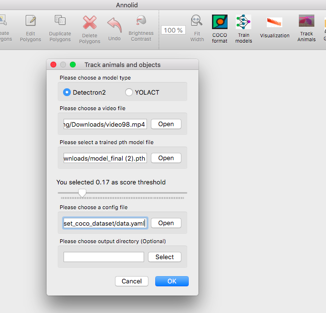

# Track animals and Auto labeling

Click `Track Animals` button on the toolbar, fill the info in the opened dialog as follows. 

Use `Detectron2` as the default model type

Choose the video file path and provide the trained model file with .pth format

Select a class threshold between 0 and 1

Provide the data.yaml file path in the COCO dataset folder

The output result folder is optional.

Note. You need to [install `Detectron2`](https://healthonrails.github.io/annolid/install.html#install-detectron2-locally) on your local device. If your workstation does not have a GPU card, it will only extract the key frames from the provided video and will save predicted results as json format in the same png image folder. 
Here is an example of predicted polygon annotions. 

The GPU workstation will run inference for all the frames in the provided video and will save the predicted results into a CSV file.