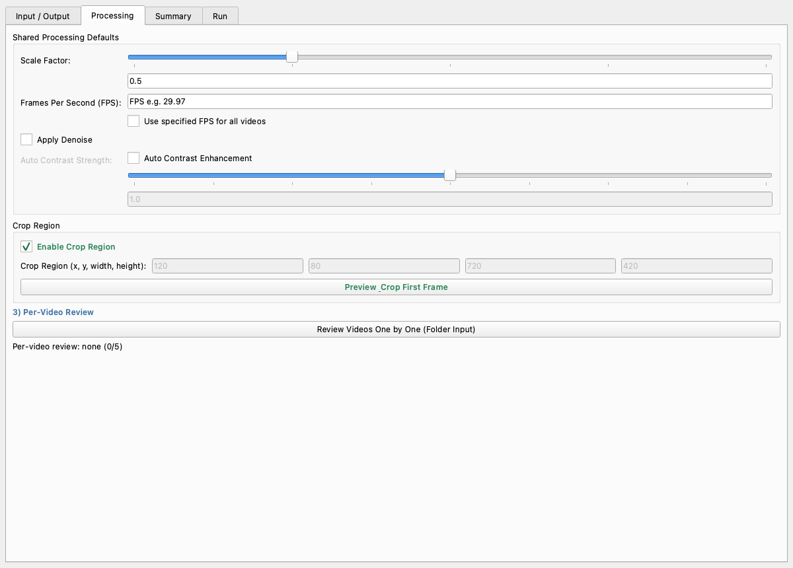
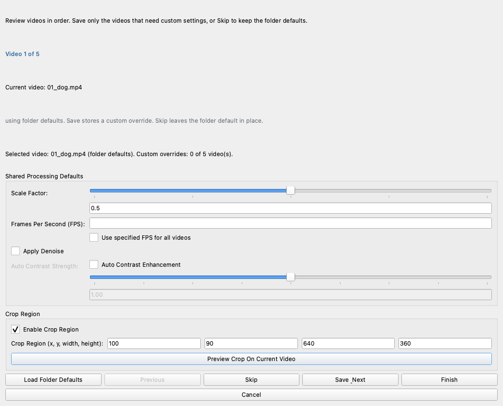

# Video Downsample Workflow (GUI)

This tutorial walks through Annolid's built-in **Downsample / Rescale Video** dialog for single videos and batch folders.

Use this workflow when you want to:

- reduce resolution and optional FPS for faster downstream processing,
- apply denoise and contrast adjustments,
- set one shared default for a folder,
- override only the few videos that need different settings,
- set a custom crop for a specific video when reviewing a folder,
- keep reproducible processing records (`metadata.csv` and per-video `.md` files).

## Open the Tool

In the desktop app, open:

- **`File` -> `Downsample Video(s)…`**

The dialog has four tabs:

1. `Input / Output`
2. `Processing`
3. `Summary`
4. `Run`

This is the main dialog layout. The folder-review flow lives in the `Processing` tab and opens the sequential per-video override dialog from there.

## Step 1: Choose Input and Output

In `Input / Output`:

1. Click **`Select Video`** for one-file processing, or **`Select Folder`** for batch processing.
2. (Recommended) click **`Select Folder`** under **Output Folder** and choose a clean destination.

If output is left blank, Annolid automatically creates a sibling folder with `_downsampled` appended to the source folder name.

## Step 2: Configure Shared Defaults

In `Processing`, set the baseline configuration for all videos:

- **Scale Factor**: `0.5` halves width/height, `0.25` quarters them.
- **Use specified FPS for all videos**: checked = force one FPS for all files; unchecked = keep source FPS per video.
- **Apply Denoise**: useful for noisy recordings.
- **Auto Contrast Enhancement**: enables brightness/contrast correction.
- **Auto Contrast Strength**: tune from `0.0` to `2.0` (default `1.0`).

### Crop Options

Use **Crop Region** as the default crop for the batch. If one video needs a different crop, you can override it later during folder review.

- Turn on **`Enable Crop Region`**.
- Set `x, y, width, height` manually, or
- Click **`Preview & Crop First Frame`** to draw crop visually.

## Step 3: (Folder Only) Review Videos One by One

If your input is a folder, you can apply per-video exceptions, including a different crop for a specific video.

1. Click **`Review Videos One by One (Folder Input)`**.
2. For each file:
   - keep defaults with **`Skip`**,
   - or set custom values, including a one-off crop, and click **`Save & Next`**.
3. Use **`Previous`** to revisit earlier files.
4. Use **`Load Folder Defaults`** to reset the current video back to shared settings.
5. Click **`Finish`** when done.

Best practice: only save overrides for true exceptions. Keep the common case in shared defaults.
If one recording was captured from a different camera angle, use the review dialog to give that video its own crop without changing the rest of the folder.

## Step 4: Verify the Summary

Open `Summary` and confirm:

- input source and mode,
- output folder,
- default processing values,
- number of per-video overrides,
- run actions selected.

Use **`Refresh Summary`** after making changes.

## Step 5: Run Processing

Open `Run` and select at least one action:

- **`Rescale Video`**: re-encodes videos with current settings.
- **`Collect Metadata Only`**: writes metadata/report files without re-encoding.

Click **`Run Processing`** to start.

## Output Artifacts

Annolid writes audit-friendly outputs in the target folder:

- `metadata.csv` with video metadata,
- one `*.md` report per processed/inspected video,
- processed `*_fix.mp4` videos when `Rescale Video` is enabled.

Per-video markdown reports include:

- effective downsample parameters,
- whether per-video review override was used,
- whether the override included a custom crop,
- FFmpeg command used (when re-encoding),
- resulting metadata.

## Practical Presets

### Preset A: Fast review copies

- Scale factor: `0.5`
- Override FPS: on, FPS: `15`
- Denoise: off
- Auto contrast: off
- Crop: off

Use when you want lightweight videos for annotation speed.

### Preset B: Low-light behavior recordings

- Scale factor: `0.5`
- Override FPS: off
- Denoise: on
- Auto contrast: on
- Strength: `1.1` to `1.3`

Use for noisy, dim recordings where object visibility is poor.

### Preset C: Arena-only crop batch

- Scale factor: `0.5`
- Override FPS: off
- Denoise: optional
- Auto contrast: optional
- Crop: on (shared arena rectangle)
- Per-video review: only for camera-shift outliers

Use when most videos share a stable camera angle.

### Preset D: One outlier video with a different crop

- Scale factor: `0.5`
- Override FPS: off
- Denoise: optional
- Auto contrast: optional
- Shared crop: on for the main arena
- Per-video review: use a custom crop for the outlier video only

Use when a folder mostly shares one arena view, but a single file needs a tighter or shifted crop.

## Troubleshooting

- **"Run" does nothing**: ensure at least one action is checked (`Rescale Video` or `Collect Metadata Only`).
- **Per-video review is disabled**: it is available only for folder input mode.
- **Custom crop not sticking for one file**: open the per-video review dialog, set the crop for that video, and click **`Save & Next`** or **`Finish`** before running the batch.
- **Crop not applied**: confirm **`Enable Crop Region`** is checked and all crop values are valid integers with positive width/height.
- **FPS errors**: if override is enabled, FPS must be numeric and > 0.
- **Unexpected output location**: check `Summary` to confirm the resolved output folder before running.

## Related Guides

- [Video FFmpeg Processing with Annolid Bot](video_ffmpeg_processing.md)
- [Tutorials Overview](../tutorials.md)
