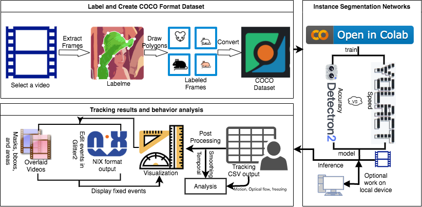
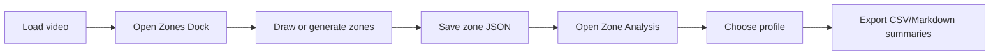
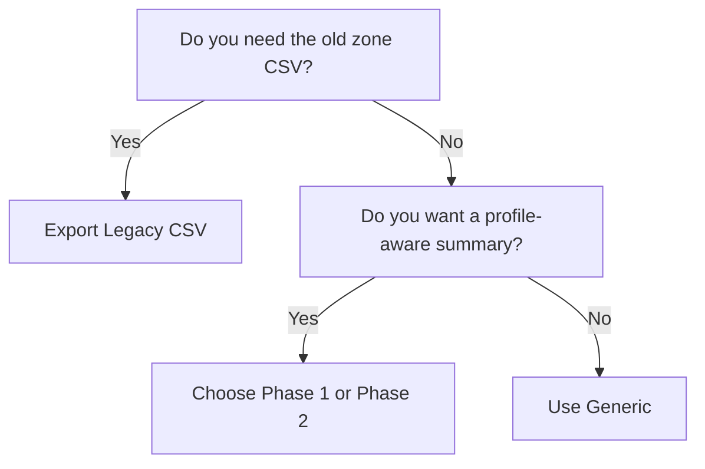

# Zone Analysis Workflow

Use Annolid's zone tools when you need chamber, doorway, barrier-edge, or custom region analysis on a loaded video frame.

This workflow is designed for studies where the same saved zones may be reused across multiple videos or assay phases, but the interpretation changes by profile.

## Visual Tour

The Zone Dock lives in the main Annolid workspace. Load your video, then open it from **Video Tools** so you can draw directly on the current frame.

The overall flow is:

## What You Get

Annolid now supports three related outputs:

- **Legacy place-preference CSV**
  - Keeps the historical one-column-per-zone export.
  - Useful if you already have downstream scripts built around the old format.
- **Generic zone metrics CSV**
  - Adds occupancy, dwell time, entry counts, transition counts, and barrier-adjacent time.
  - Works with any valid saved zone set.
- **Assay summary Markdown + CSV**
  - Explains which zones were used.
  - Shows which phase rules were applied.
  - Lists the metrics that were computed.

## Step 1: Open the Live Frame

1. Start Annolid and load the video you want to annotate.
2. Move to the frame that best represents the arena layout.
3. Open **Video Tools → Zones**.

The Zone Dock uses the current Annolid canvas. You draw directly on the loaded video frame, not in a separate blank editor.

## Step 2: Create a Zone Layout

You can either:

- draw zones manually with the polygon, rectangle, or line tools, or
- click **Generate Preset** and choose either **3x3 Chamber Layout** or **3x3 Social Door Layout**.

The chamber preset is a fast starting point for common chamber arenas. It creates nine editable chamber shapes on the current frame. The social-door preset creates eight rover-side approach zones around the mesh doors. After generation, you can still drag, resize, rename, recolor, or delete individual zones.

### What the 3x3 preset looks like

The preset is meant to be a starting point, not a locked template:

- all nine chambers are editable,
- chamber names are just defaults,
- blocked and open passages should still be labeled explicitly,
- the preset is saved as ordinary shapes, so you can keep refining it manually.

### Recommended For Chamber Assays

For a chamber-based vole assay:

- use **3x3 Chamber Layout** as the starting point,
- rename chambers to match the experimental setup,
- mark blocked passageways or barrier-edge regions explicitly,
- keep one zone file per video unless the arena geometry is guaranteed to be identical.

## Step 3: Tag the Zones

Each saved zone shape should carry explicit semantics:

- `zone_kind`
- `phase`
- `occupant_role`
- `access_state`

For example:

- chamber zones: `zone_kind=chamber`
- blocked areas: `access_state=blocked`
- open areas: `access_state=open`
- phase-specific layouts: `phase=phase_1` or `phase=phase_2`

The dialog pre-fills these fields for new zones so you do not need to hand-edit JSON.

## Step 4: Save the Zone File

Click **Save Zone JSON** in the Zone Dock.

Recommended naming:

- `video_stem_zones.json`

Annolid keeps the zone file in LabelMe-compatible JSON so it can be reloaded later and edited on the live canvas.

The zone dock now separates authoring into three views:

- **Define Zones**
  - review the current frame, target JSON path, and every zone already on the canvas
- **Zone Details**
  - edit the selected zone label, description, kind, phase, occupant role, access state, tags, and barrier-adjacent flag
  - reuse a tuned zone as the default template for the next zones you draw
- **Metrics**
  - preview zone area and see which downstream metrics the selected zone will affect before you run analysis

## Step 5: Run Zone Analysis

Open **Video Tools → Zone Analysis**.

Pick the assay profile:

- **Generic** for a profile-neutral analysis
- **Phase 1** when you want access rules to reflect the partially blocked chamber layout
- **Phase 2** when all chambers and passageways should be treated as available

Then choose one of the outputs:

- you can use **Output Mode** plus **Run Selected Export** for a guided single-action workflow, or use the dedicated quick buttons.

- **Export Legacy CSV**
  - Historical format, one column per zone.
- **Export Zone Metrics**
  - Generic metrics CSV with occupancy, dwell, entries, transitions, and barrier-adjacent counts.
- **Export Assay Summary**
  - Markdown report plus CSV metrics that explain the zones, phase rules, and metrics in plain language.

### How to choose the profile

- Use **Generic** when you want the raw zone set without phase filtering.
- Use **Phase 1** when some chambers or connections are blocked by mesh.
- Use **Phase 2** when the arena is fully open.
- Use **Export Assay Summary** when you want a report that explains the chosen zones and phase rules in plain language.
- Use **Export Social Summary** when you want latency to first social-zone entry, rover-side door proximity, and pairwise centroid distance for tracked voles.

## What The Metrics Mean

- **Occupancy**: how many frames the instance was inside a zone
- **Dwell time**: contiguous frames spent in a zone before leaving it
- **Entry count**: how many times the instance entered a zone
- **Transition count**: how many times the instance moved from one zone to another
- **Barrier-adjacent time**: frames spent in zones marked as barrier-edge or similar access-control regions
- **Latency**: the first frame or timestamp at which a vole enters a zone; if you do not set a reference frame, the social summary uses the first analyzed frame as the reference point

## Phase 1 vs Phase 2

Use the same saved zone file for both phases if the physical layout is shared.

- **Phase 1**
  - some chambers or passageways may be blocked by mesh
  - summaries focus on the zones that are accessible in the partial-access condition
- **Phase 2**
  - all chambers and passageways are treated as open
  - summaries reflect direct interactions across the full arena

The assay summary report lists the selected profile, the included zones, the blocked zones, and the computed metrics so the output is self-documenting.

## Practical Workflow for Vole Assays

1. Load the phase video.
2. Open the Zone Dock.
3. Generate the 3x3 preset.
   - Use **3x3 Chamber Layout** for chamber occupancy.
   - Use **3x3 Social Door Layout** for rover-side approach zones.
4. Rename the zones to match the arena map.
5. Mark blocked or open passageways explicitly.
6. Save the zone JSON next to the video.
7. Run Zone Analysis and select the correct assay profile.
8. Export the assay summary or social summary for review and sharing.

## Example Assay Summary Output

The assay summary file is designed to be readable without opening the GUI:

- the header states which profile was used,
- the phase rules section explains what counts as accessible,
- the zone coverage section shows which zones were included and excluded,
- the metrics section lists the computed outputs,
- the social summary lists the latency reference frame and the anchor source used for each vole,
- the CSV companion uses the same metadata contract so scripts can parse it reliably.

## Tips

- Keep one local zone JSON per video by default.
- Reuse a shared layout template only as a starting point.
- Recheck the saved zones after crop or resolution changes.
- If you see unexpected zone results, confirm the correct assay profile was selected before exporting.
